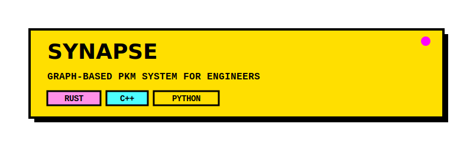
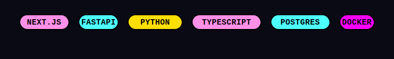

  

 

<!-- Two‑column layout: project card + architecture -->

  
  

 

<!-- Tech stack -->

  

 

<!-- Terminal -->

  

 

<!-- Footer -->

  

---

### Synapse – Graph‑Based Knowledge Management

**Synapse** transforms fragmented notes into an interconnected semantic network.  
Every idea is a **Node**, every relationship an **Edge**.

- **Semantic Search** – PostgreSQL Full‑Text Search with relevance ranking.
- **Interactive Graph** – Drag‑and‑drop connections with React Flow.
- **One‑Command Deploy** – `docker-compose up --build`.

> *"The graph becomes a mirror of your understanding."*

[📖 Full Documentation](https://github.com/SkyArjun99/synapse) <!-- You can link to your detailed readme if you add it -->