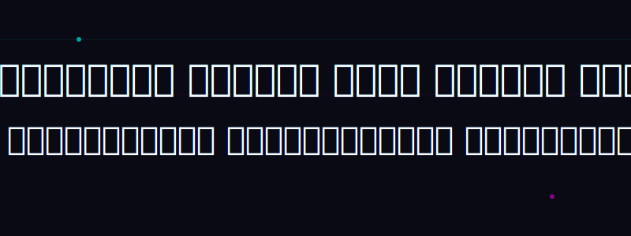
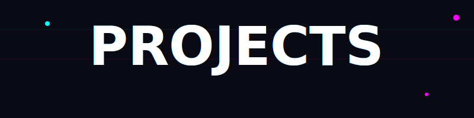
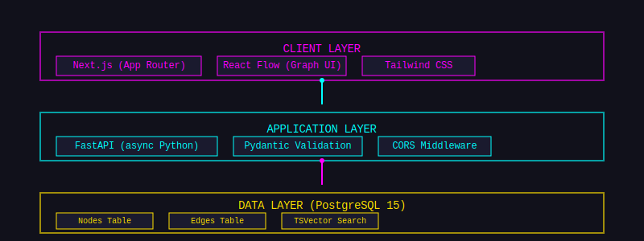
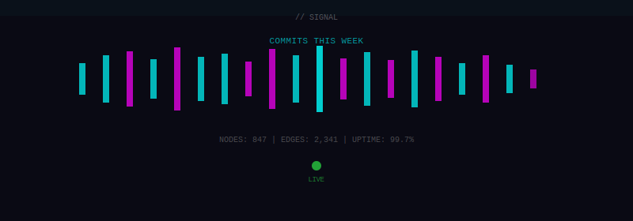

  
  

     <!-- === PROJECTS HEADER === -->

  

 

<!-- === GITA VERSE === -->

  

    

    

    

  

  

    

    

    

    

    

  

  

<!-- arjun1k-dev — Building Crazy Systems. Graph-based knowledge management, interactive visualizations, and full-stack engineering. See project repos for code and docs. -->

